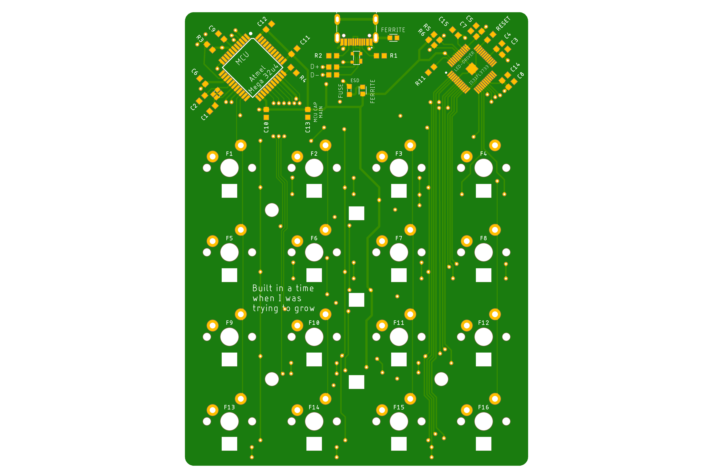
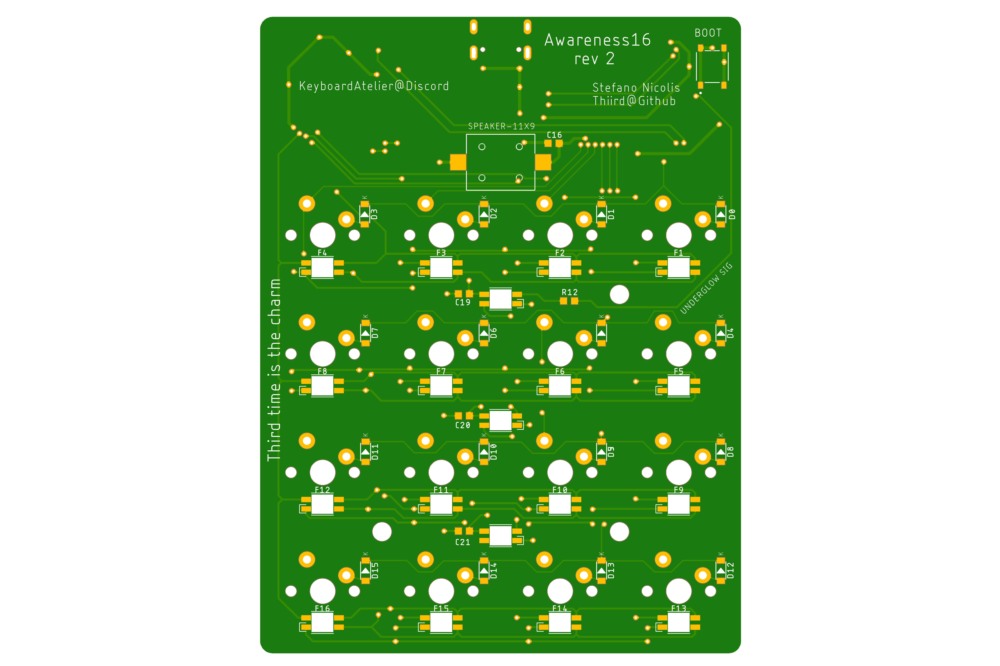

# Awareness16
Mechanical macropad, used as pathfinder for my first custom mechanical keyboard build.  

**SPECS**  
-16 1U keys in a 4x4 matrix, MX footprint

-USB C, CtoC compatible

-RGB Matrix, 6028 SMD LEDs 

-RGB underglow, SK6812MINI-E SMD LEDs

-ESD protection

-MCU: Atmega 32u4, TQFP44 package

-LED driver: IS31FL3733, eTQFP-48 package

# Renderings

**PCB top**

     
**PCB bottom**

# Credits
Without the help of many generous and patient people online I would have never been able to complete
this project.

Special thanks to:
- Hadi for making a pcb guide series: https://www.youtube.com/channel/UCpWGAJr2AU7LPUwVYbBQZRg
- People on the Keyboard Atelier discord
- People on the QMK discord
